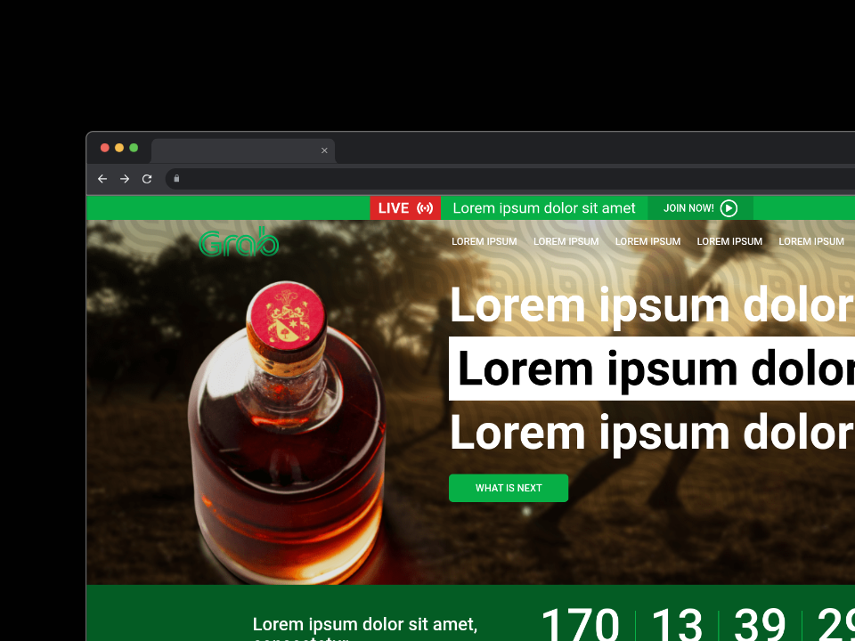
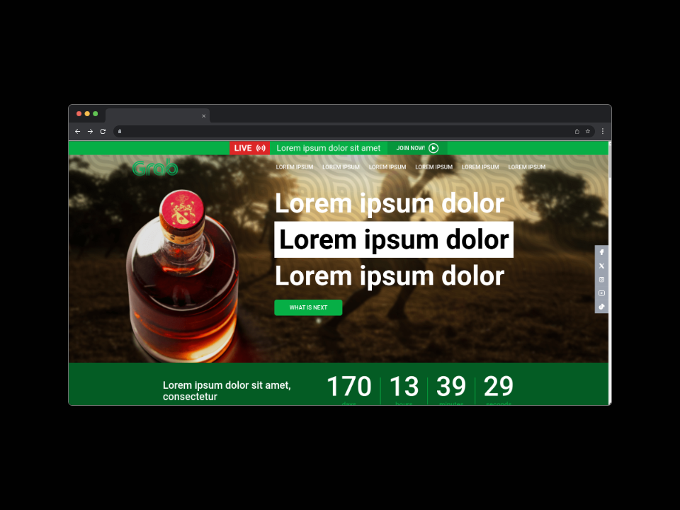
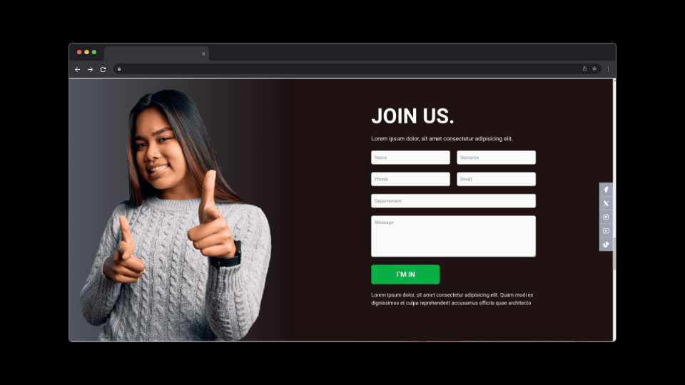
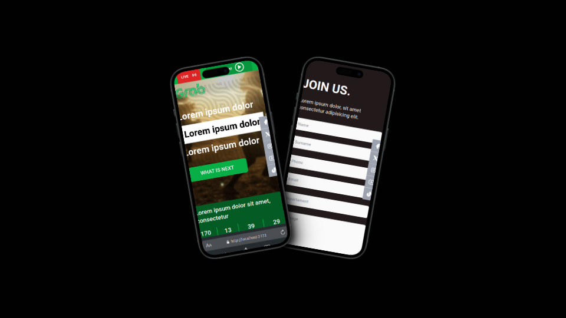

# PRUEBA WEB 1920 - 1

- [x] Visualización de diseño planteado con los recursos subministrados

- [x] Se adapta Responsive

## Librerias implementadas

- [Swiper](https://swiperjs.com/)

- [Tailwindcss](https://tailwindcss.com/)
